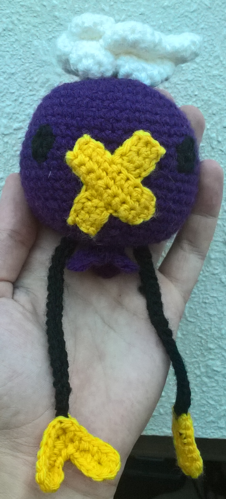

# Drifloon pattern

## Result

## Pattern

### Requirements

Wool:
- Purple (for the body, the big part)
- Yellow (nose and \~hands\~)
- White (cloud)
- Black (arms and eyes)

### Best order for the parts

I advise to start the body, but leave it open to add the cloud, nose, eyes and arms. Then it can be closed. I added the arms in between two rounds, and then stitched (the purple wool) through the arm to prevent it from moving

### Body

In purple, in single crochet:

In circles: increase by 8 every round until 48 stitches, then 13 rounds of 48 stitches, then decrease by 8 every round. At the end, remember to fill the body. Instead of closing the last round, I restarted by increasing, and alternating double/triple crochet with single crochet to make the bottom.

### Cloud

Do 7 times: round of 8, 4 increases (12), and one normal rank (12).

Then these parts are stitched together. Stitch 3 parts on one part, and then stitch the 3 remaining on top of the 3 parts. To close it, do single crochet, and do rounds of 6 stitches (3/4 rounds), and then close it.

### Nose

In yellow. The goal is to make a cross in two straight lines.

First line:
Do 3 rows of 9 sc, going back and forth starting from a chain.

The second line is divided in two to avoid the nose to be bigger in the center where the two parts will overlap. Do 3 rows of 3 sc (back and forth), then 6 chains and then 3 rows of 3 sc (back and forth).

Then stitch the full line on top of the divided line in the body

### Arms

A long double chain.

### Hands

Do a chain of 10, 2sc, decrease by 2, 2 sc, increase by 5, 3 sc, increase by 2, 2 sc, increase by 5, slip-stitch.
Do it twice.
You can either stitch the hands to the arms when they are finished, or during the making of the hands to hide remaining wool.

## Difficulty

2/5 overall, 4/5 for the cloud. I mostly improvised. The cloud is kind of hard to do because it is very small.