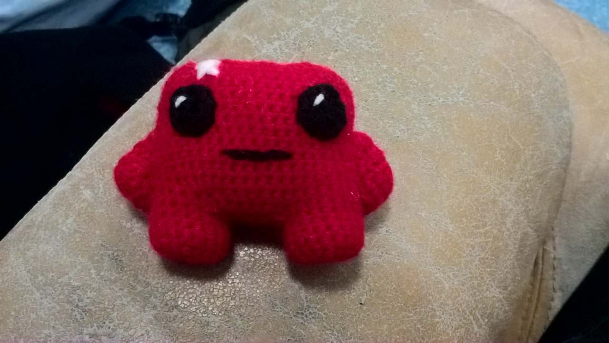

# Meat Boy

Meat Boy from Super Meat Boy. The pattern is inspired from an image of the game.

 

## Material

Red wool
A little bit of black
Few white

## Pattern

### Foot

Start with a magic knot of 8 sc, sl st, then do 8 augmentations, sl st, then 4 normal ranks.

### Arms

Do a magic knot of 6 sc, sl st, 6 aug, sl st, then one rank, then do 10 sc, start a new rank by jumping a stitch do 8 sc. New rank, jump a stitch, 7 sc, new rank, jump a stitch 6 sc, new rank jump a stitch 4 sc, and then do sl st around the border of the arm to make it smooth.

### Body

Start from a foot, do X ch, and then turn sc on the next foot. Choose X such that the foot are well spaced (I don't remember for mine). Then turn, X-1 sc on the chain, sc on the first foot, turn X-2 sc, sc on the foot, turn X-1 sc, sc on the foot, turn X sc, and then do a lot of ranks in spiral