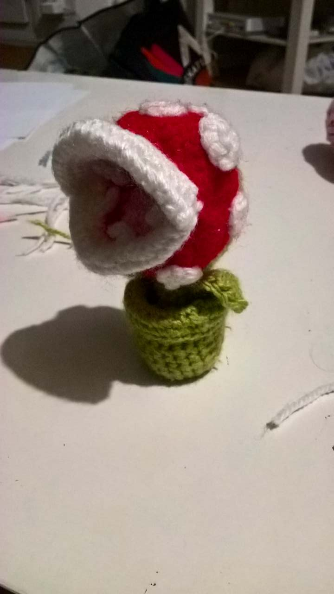
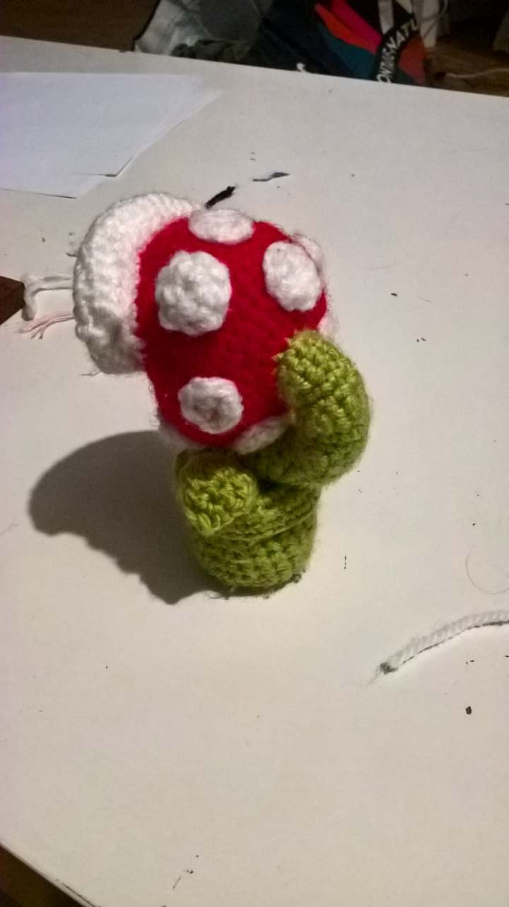

# Piranha Plant (Mario)

 

## Material

Green, red, white, pink and black or brown.

## Pattern

### Pot

Do two rounds of circle with 8 sc for beginning. Then do some normal ranks, then (aug, sc, sc)\*8, then 3 normal ranks, fold and sew it.

### Heart in the pot

In the pot, do a rank of brown/black sc by picking in the green of the pot. Remember to stuff and then decrease and sew it together.

### Stem

Do a circle by doing sc from the brown/black wool. The stem is done in circles of 10 stitches. I did two leaves following [this tutorial][https://www.youtube.com/watch?v=50pU-CJ0QvY], but I made them smaller (don't do the triple crochet). To do the curve, I did some rank increases (see the main [Readme tutorial][../README.md]). Firs I did one, and after some ranks, I did two. I also sew the bottom of the stem with the pot to make it stronger.

### Head

To do the Head, start a ball (increasing by 6 stitches every round) then do 2 normal rank. After that, start almost half of a normal rank but turn back after the (almost) half. Then work in "going-coming" (_aller-retour in french_) and decrease every time. Whene there are only around 6-8 stitches, stop. Start the same work on the other side with a new wool. When finishing the next one, do a rank of sc to clean the border of the red part. This rank will be the start of the lips.

### Lips

To do the lips, work in "going-coming" and do 3-4 increases after two ranks (this is where the lips will turn). Do two more ranks, sew everything.

### Mouth

To do the interior of the mouth, do a rank of red sc inside the mouth. On the upper part, start a rank with decreases (dec, sc) and when arriving in the middle, just do 6-7 ch to go on the other side and continue the interior. Decreases until you can't anymore, sew.

The pink part is done in the same way, just remember to fill everything.

### Teeth

The teeth are done when sewing the white lips. They are done with 5 ch, jump 2 ch and do a sc, sc, and keep on sewing until the next tooth.

